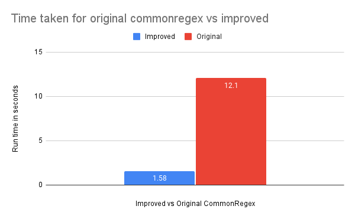

<br><br>

<h1 align="center">CommonRegex Improved (crim)</h1>

<p align="center">
  <a href="/LICENSE"></a>
  <!--  -->
   
   <a href="https://twitter.com/brootware"></a>
    
   <a href="https://sonarcloud.io/summary/new_code?id=brootware_commonregex-improved"></a>
   
</p>

<p align="center">
  An improved version of commonly used regular expressions in Python
</p>

<br><br>

> Inspired by and improved upon [CommonRegex](https://github.com/madisonmay/CommonRegex)

This is a collection of commonly used regular expressions. This library provides a simple API interface to match the strings corresponding to specified patterns.

## Installation

```bash
pip install --upgrade commonregex-improved
```

## Usage

```python
import crim as CommonRegex

text = "John, please get that article on www.linkedin.com to me by 5:00PM on Jan 9th 2012. 4:00 would be ideal, actually or 5:30 P.M. If you have any questions, You can reach me at (519)-236-2723x341 or get in touch with my associate at harold_smith@gmail.com. You can find my ip address at 127.0.0.1 or at 64.248.67.225. I also have a secret protected with md5 8a2292371ee60f8212096c06fe3335fd. The internal webpage to get the article from is https://internal.sharepoint.edu.au"

date_list = CommonRegex.dates(text)
# ['Jan 9th 2012']
time_list = CommonRegex.times(text)
# ['5:00PM', '4:00 ', '5:30 P.M.']
url_list = CommonRegex.links(text)
# ['www.linkedin.com', 'gmail.com', 'https://internal.sharepoint.edu.au']
phone_list = CommonRegex.phones_with_exts(text)  
# ['(519)-236-2723x341']
ip_list = CommonRegex.ips(text)
# ['127.0.0.1', '64.248.67.225']
email_list = CommonRegex.emails(text)
# ['harold_smith@gmail.com']
md5_list = CommonRegex.md5_hashes(text)
# ['8a2292371ee60f8212096c06fe3335fd']
```

## ⚔️ Performance benchmark

[CommonRegex](https://github.com/madisonmay/CommonRegex) is awesome!

So why re-implement the popular original commonregex project? The API calls to each of the regular expressions are really slow.

It takes 12 seconds for a total of 2999 calls to Dates function in the original version of CommonRegex. While the improved version of CommonRegex with the same number of calls merely takes 2 seconds.



You can find more detailed results about [original](./benchmark/original_cregex_result.pdf) and [improved](./benchmark/cregex_improved_result.pdf) versions.

## Features / Supported Methods

* `dates(text: str)`
* `times(text: str)`
* `phones(text: str)`
* `phones_with_exts(text: str)`
* `links(text: str)`
* `emails(text: str)`
* `ipv4s(text: str)`
* `ipv6s(text: str)`
* `ips(text: str)`
* `not_known_ports(text: str)`
* `prices(text: str)`
* `hex_colors(text: str)`
* `credit_cards(text: str)`
* `visa_cards(text: str)`
* `master_cards(text: str)`
* `btc_address(text: str)`
* `street_addresses(text: str)`
* `zip_codes(text: str)`
* `po_boxes(text: str)`
* `ssn_numbers(text: str)`
* `md5_hashes(text: str)`
* `sha1_hashes(text: str)`
* `sha256_hashes(text: str)`
* `isbn13s(text: str)`
* `isbn10s(text: str)`
* `mac_addresses(text: str)`
* `iban_numbers(text: str)`
* `git_repos(text: str)`
